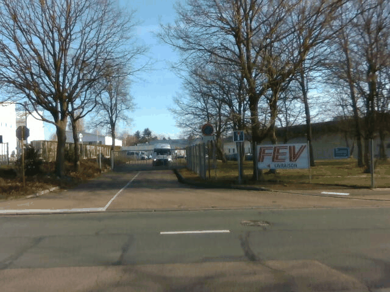
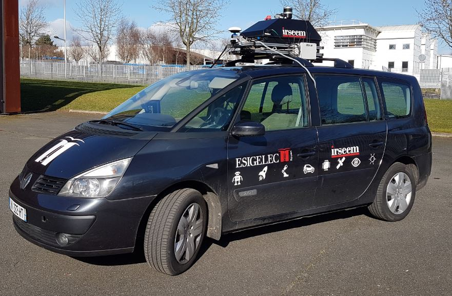

# Particle filter meets hybrid octrees: an octree-based vehicle localization approach without learning (Submitted by [ESIGELEC](https://www.esigelec.fr/))

## News :
* 2022/12/15 : Update dataset directories (datasets off-road will be availaibles soon)

* 2020/07/17 : A new dataset is availaible  [here](#JULY) on same road than previous.

* 2020/06/18 : A new dataset is availaible  [here](#JUNE) on same road than previous.

* 2020/05/15 : A new dataset is availaible  [here](#MAY) on same road than previous.

* April 2020 : Due to the COVID19, no dataset were done in appril.

* 2020/03/17 : A second dataset is availaible  [here](#MARCH) on same road than previous.

* 2020/02/18 : A first dataset is availaible (dataset used for paper) [here](#FEBRUARY).

## Abstract :
This paper presents a 6 DoF (Degree of Freedom) real-time vehicle localization based on hybrid octrees and particle filtering of LiDAR data. Our approach is based on two lightweight frameworks. It makes it possible to reduce the memory footprint of the map and significantly lowers the computation load for online localization. Our approach has shown to perform well on both CPUs and GPUs. The algorithm design makes it possible to run the localization simultaneously on both architectures. Our localization method is LiDAR agnostic. Our experiments have been carried out with two distinctive LiDAR technologies: scanning LiDAR and flash LiDAR. Our extensive experimental validation shows that our method is both accurate and reliable on several datasets, platforms and environments. We have especially shown that the same localization algorithms and parameters can perform well in urban and offroad environments. We have also evaluated the robustness of our method when masking angular sectors of the LiDAR field of view. The performance achieved with the flash LiDAR is close to the scanning LiDAR despite different resolutions and sensing modalities. The positioning performance is significant with 10cm and 0.12$\degree$ angular RMSE for both technologies. We evaluated our approach on the KITTI dataset and achieved fair results with respect to the state of the art. This paper also introduced the baseline performance on a multi-seasonal dataset we are publicly releasing to the community. We validated our approach in an off-road environment from a front view field of view with only 768 LiDAR points.

Vincent VAUCHEY¹, Pierre MERRIAUX², Xavier SAVATIER³, Yohan DUPUIS⁴.  
¹[ESIGELEC](http://www.esigelec.fr/) , IRSEEM, Rouen, France, Normandie Univ, UNIROUEN, 
²[Leddartech](http://www.leddartech.com.),   Quebec   City,   Canada 
³[ESIGELEC](https://navya.tech/fr/) , NAVYA, Paris, France
⁴[CESI](http://www.cesi.fr/) , CESI, La Défense, Paris, France, 

vvauchey@cesi.fr
pierre.merriaux@leddartech.com
xavier.savatier@navya.tech
ydupuis@cesi.fr
fourre@esigelec.fr

Special Thanks to the members of the [SIRD](http://www.esigelec.fr/en/node/113) team : Marc DEHAIS, Anthony DESHAIS, Christophe ALEGRE, Pascal FALLA, Jérémy FOURRE
# Datasets
Dataset Lidar/IMU/RGBD Camera done by [ESIGELEC](http://www.esigelec.fr/).

Some new dataset on same roads will be availaible each mounth.

The main reference dataset for lidar localisation is [KITTY](http://www.cvlibs.net/datasets/kitti/) dataset and is used for a lot of paper and result comparaisons beetweens localization/SLAM algorithms. The main difficultiy to use [KITTY](http://www.cvlibs.net/datasets/kitti/) dataset is the ground true accuracy which is many times more than 20 cm.

We try to provide to the community some datasets done with a reference position with best positioning systems avaiblaibles in all conditions.
The datasets ground True is done with a Landyns ([IXblue](https://www.ixblue.com/)) IMU based on fiber-optic-gyroscope (FOG), which is a technology wich ensure very low shift and noise between two gps position or when the gps accurancy become low.
In addition of this very high accurate IMU, we're also using a postprocessing application ([APPS](https://www.ixblue.com/products/apps)) coupled whith a GPS RTK [septentrio](https://www.septentrio.com/) . The goal of this application is to increase the accuracy of ground true position especially when there is tree/tunnel by doing forward/backward Kallman Filter. Landyn IMU is an "old" IMU without new firmware release but with better FOG than IMU currently in sale for civil application by [IXblue](https://www.ixblue.com/). The fact to use APPS software give the possibility to use processing algorithms used on the last IMU in sale by ([IXblue](https://www.ixblue.com/)) on our Landyn.

## IMU COMPARAISON :
| IMU  | LANDYN ([IXblue](https://www.ixblue.com/))        | ATLANS ([IXblue](https://www.ixblue.com/))  | RT 3000 ([Oxts](https://www.oxts.com/))
| :--------------- |:---------------:|:---------------:|:---------------:|
| Position when RTK lost (m)  | 0.20 (GNSS outage 60s) | 0.350 (GNSS outage 60s)  |  1.5 (SPS)
| Pitch/Roll (deg)  | 0.005 (RTK) / 0.005 (GNSS outage 60s) | 0.008 (RTK) / 0.01 (GNSS outage 60s) | 0.03
| Heading (deg)  | 0.01 | 0.020 | 0.1

#### DATASET 2020/02/18 : 
* Loop1 : Winter sun and some clouds (~1.5km)
    * [30 km/h dataset A (Download)](https://esigelec-my.sharepoint.com/:f:/g/personal/fourre_esigelec_fr/EoIzHXdWnotOgE2SHytIZdQBep1mAMpel_PV1z5khQQOuQ?e=c8RLRy)
    * [30 km/h dataset B (Download)](https://esigelec-my.sharepoint.com/:f:/g/personal/fourre_esigelec_fr/EqgAV-Hk60pAghTUWenH9AEBXBSaAAVRq-gAqKZs7RvxEg?e=OfsuKV)
    * [40 km/h dataset (Download)](https://esigelec-my.sharepoint.com/:f:/g/personal/fourre_esigelec_fr/EoWtZtLupKtAlZpaAkfg2x8BeHz_CzU8TwBdDTDXL4o55w?e=gHWus3)
    * [50 km/h dataset (Download)](https://esigelec-my.sharepoint.com/:f:/g/personal/fourre_esigelec_fr/EtxpS0xGX9BPuNm29J0_SZMB3dRW977arGx78Yet_2CFow?e=dpRSrq)
    * [Directory Tree and calibrations](#TREE)

    

    [maps preview](https://www.google.com/maps/d/embed?mid=1cAdJnWjBnK7ZZkCva8ftSXN_qYLh2o9t)
    
    

        

* Loop2 : Winter sun and some clouds with one short tunnel (~2.6 km)

    * [30 km/h dataset (Download)](https://esigelec-my.sharepoint.com/:f:/g/personal/fourre_esigelec_fr/EvKdvaHJ-15DuqQNvcFTs_cBeU0N4Jj47X_Eo9seEy2U-A?e=0MynMT)
    * [40 km/h dataset (Download)](https://esigelec-my.sharepoint.com/:f:/g/personal/fourre_esigelec_fr/EnQVRVI6txpDruEbV8LkIx4B-7UINeZN_6FGxuP4kVOyKQ?e=mBPcPp)
    * [50 km/h dataset (Download)](https://esigelec-my.sharepoint.com/:f:/g/personal/fourre_esigelec_fr/ElXGShe0LRxHvg9w1i71_VwBrQE-Va-TjdJKHjhHh4zJ1Q?e=0SenAk)
    * [Directory Tree and calibrations](#TREE)

    

    [maps preview](https://www.google.com/maps/d/embed?mid=1aRvGyCyWWRs2k5G5HH2M6DCKO5p3p3LA)

#### DATASET 2020/03/17 :
Images will be availaible as soon as the containment due to the COVID19 will be finish.

* Loop1 : Winter sun (~1.5km)
    * [30 km/h dataset A (Download)](https://esigelec-my.sharepoint.com/:f:/g/personal/fourre_esigelec_fr/EtkuBDG2nExJs2y2oc-sXaEB5EOqpV2TH25wOYz99KEBOQ?e=eKVds5)
    * [30 km/h dataset B (Download)](https://esigelec-my.sharepoint.com/:f:/g/personal/fourre_esigelec_fr/EnyWA83yorhGjSyGfhrHmoEBKwhsIzTVYcAm7f-XIu6rIQ?e=nFHG3Y)
    * [40 km/h dataset (Download)](https://esigelec-my.sharepoint.com/:f:/g/personal/fourre_esigelec_fr/Ek1qKLwSUaNEoltFgcAfYJ4Bj05W6p051aWf31IsVe1j0A?e=AVHCcF)
    * [50 km/h dataset (Download)](https://esigelec-my.sharepoint.com/:f:/g/personal/fourre_esigelec_fr/EjG-OhERFkhIknx2gOh0b8YB4vMQU_KxknMF9wlAov8isA?e=3HXONo)
    * [Directory Tree and calibrations](#TREE)

    

* Loop2 : Winter sun  (~2.6 km) {: #funky }

    * [30 km/h dataset (Download)](https://esigelec-my.sharepoint.com/:f:/g/personal/fourre_esigelec_fr/EmiPIIidclFBrmHdDObesPgBdoksZgeBP0XgFuXUeKIw-g?e=byAIV8)
    * [40 km/h dataset (Download)](https://esigelec-my.sharepoint.com/:f:/g/personal/fourre_esigelec_fr/EiQtuLBdXnpFt6rGvTT3fIYB-1zc4AVW51xuUk1jCVK1uw?e=hOPRVF)
    * [50 km/h dataset (Download)](https://esigelec-my.sharepoint.com/:f:/g/personal/fourre_esigelec_fr/EtF9YeO261dEkDctKjJfnhkBOn1zI09AG7i1EipBEI8w3g?e=DM2Lmr)
    * [Directory Tree and calibrations](#TREE)

    

#### DATASET 2020/05/15 : 
* Loop1 : spring (~1.5km)

    * [30 km/h dataset A (Download)](https://esigelec-my.sharepoint.com/:f:/g/personal/fourre_esigelec_fr/EtoxeUpmw8JJoA2aehZhFs0B3qtVP31cJOnJ2Mi-DLmpGw?e=7wfCRM)
    * [30 km/h dataset B (Download)](https://esigelec-my.sharepoint.com/:f:/g/personal/fourre_esigelec_fr/EhzXc_y5HC9FuB-AsWFsCMgBMjjShrPBdqGZ2B3nM_uRBw?e=9xAJ6C)
    * [40 km/h dataset (Download)](https://esigelec-my.sharepoint.com/:f:/g/personal/fourre_esigelec_fr/Etvo_0TD52lCqL9woqNDvU8BWoHFnqcCIRU2GgSqF28ltA?e=GEqdha)
    * [50 km/h dataset (Download)](https://esigelec-my.sharepoint.com/:f:/g/personal/fourre_esigelec_fr/EmSVc25RDvdKtvH8jjiCSsABK16qei5JIzk8b-ERlOl1pQ?e=NKI1QC)
    * [Directory Tree and calibrations](#TREE)

    [maps preview](https://www.google.com/maps/d/embed?mid=1cAdJnWjBnK7ZZkCva8ftSXN_qYLh2o9t)
    Now no camera dataset will done due to the big amouth of data generated and the few interests of this kind of dataset.
* Loop2 :  spring (~1.5km)

    * [30 km/h dataset (Download)](https://esigelec-my.sharepoint.com/:f:/g/personal/fourre_esigelec_fr/EntwRBebZHtGp6E8BzlxSSABg-0Z3r4dyxDtfqiftzZqHw?e=6orkCo)
    * [40 km/h dataset (Download)](https://esigelec-my.sharepoint.com/:f:/g/personal/fourre_esigelec_fr/Ejj0rxZyiipLqEWx3GlPdi0BQZtwLCVCXkxi_bFGEhSYFQ?e=gGWiVE)
    * [50 km/h dataset (Download)](https://esigelec-my.sharepoint.com/:f:/g/personal/fourre_esigelec_fr/EgrydZFx6OxJr4Bcf3ZZ9vgBA6UPJlO3ELsF2p2z3yvByA?e=Lbd7cu)
    * [Directory Tree and calibrations](#TREE)

    [maps preview](https://www.google.com/maps/d/embed?mid=1aRvGyCyWWRs2k5G5HH2M6DCKO5p3p3LA)
    Now no camera dataset will done due to the big amouth of data generated and the few interests of this kind of dataset.

#### DATASET 2020/06/18 : 
* Loop1 : spring (~1.5km)
    * [30 km/h dataset A (Download)](https://esigelec-my.sharepoint.com/:f:/g/personal/fourre_esigelec_fr/Evn3GbtAvBlDkmOCGrNPThcBUNElyTo35E-K303mbgUlCw?e=abPXwf)
    * [30 km/h dataset B (Download)](https://esigelec-my.sharepoint.com/:f:/g/personal/fourre_esigelec_fr/EpZV-TUwqtJKuh03JnqLJ5sBpHryzZGiBsIQseVDlPTj-Q?e=vYmpR3)
    * [40 km/h dataset (Download)](https://esigelec-my.sharepoint.com/:f:/g/personal/fourre_esigelec_fr/Em9Nb5yZNSxMtxKbCtsDoUYB0EaB-chBdbu7FYmPdpsRWA?e=iapWf4)
    * [50 km/h dataset (Download)](https://esigelec-my.sharepoint.com/:f:/g/personal/fourre_esigelec_fr/EoUfbR31PjFAnUgK9sxOYpkBngv9IfXpkeffsF3CIoFszg?e=nsQ4bb)
    * [Directory Tree and calibrations](#TREE)

    [maps preview](https://www.google.com/maps/d/embed?mid=1cAdJnWjBnK7ZZkCva8ftSXN_qYLh2o9t)

* Loop2 :  spring (~1.5km)

    * [30 km/h dataset (Download)](https://esigelec-my.sharepoint.com/:f:/g/personal/fourre_esigelec_fr/EtUgIyKL9tFPpW3D1jZ6yUUBAwsvCvkkgYdWLzxmJpVmzw?e=VW6F6L)
    * [40 km/h dataset (Download)](https://esigelec-my.sharepoint.com/:f:/g/personal/fourre_esigelec_fr/Ervb_gbp-4BCnohUCSL94HoB4eeJ51Yo5vF8oRuXGjpKpA?e=fBeccR)
    * [50 km/h dataset (Download)](https://esigelec-my.sharepoint.com/:f:/g/personal/fourre_esigelec_fr/ElJH7foRExxEtfGL2FAt5NgBLibdES5R5AyA0iqbQQjjuw?e=2YK89q)
    * [Directory Tree and calibrations](#TREE)

    [maps preview](https://www.google.com/maps/d/embed?mid=1aRvGyCyWWRs2k5G5HH2M6DCKO5p3p3LA)

#### DATASET 2020/07/17 :
* Loop1 : spring (~1.5km)
    * [30 km/h dataset A (Download)](https://esigelec-my.sharepoint.com/:f:/g/personal/fourre_esigelec_fr/Eo7duo1OZplMnvzcNo-6EzoBQV9qr4eKJUkwJkkAjYWvZQ?e=cUaZ6E)
    * [40 km/h dataset (Download)](https://esigelec-my.sharepoint.com/:f:/g/personal/fourre_esigelec_fr/ErmSTTda69VAtxn4bNQMKmQBND2gCl3wEtX0I651Yn3Zug?e=GQZgz2)
    * [50 km/h dataset (Download)](https://esigelec-my.sharepoint.com/:f:/g/personal/fourre_esigelec_fr/EhyUtQbucspKjsBeI7H4nVMBR0UQ3i49QJ3qtsDhhyBe_w?e=Wd0AM8)
    * [Directory Tree and calibrations](#TREE)

    [maps preview](https://www.google.com/maps/d/embed?mid=1cAdJnWjBnK7ZZkCva8ftSXN_qYLh2o9t)

* Loop2 :  spring (~1.5km)

    * [30 km/h dataset (Download)](https://esigelec-my.sharepoint.com/:f:/g/personal/fourre_esigelec_fr/ErSP0eUfmiVGgUqVV2gV9EMB7LFl1ZvnPSKAPLXIMwArRg?e=JZ8GAR)
    * [40 km/h dataset (Download)](https://esigelec-my.sharepoint.com/:f:/g/personal/fourre_esigelec_fr/EiJ1WyjwVXlLov4tkh36U4MBHFCGzaKeN1PL2lyK0zF96A?e=qR8Siy)
    * [50 km/h dataset (Download)](https://esigelec-my.sharepoint.com/:f:/g/personal/fourre_esigelec_fr/Et7DyXLtSLtInteitnPOQQcB85LuKY52QPw7uKGm_8JcyA?e=B9bdab)
    * [Directory Tree and calibrations](#TREE)

    [maps preview](https://www.google.com/maps/d/embed?mid=1aRvGyCyWWRs2k5G5HH2M6DCKO5p3p3LA)

List of sensors and software used :
* vlp16 Lidar synchronised on GPS ([Velodyne](https://velodynelidar.com/))
* GPS AsterRx-U ([septentrio](https://www.septentrio.com/))
* LANDYN IMU + post processing software APPS ([IXblue](https://www.ixblue.com/))
* D435 trigged on IMU ([intelrealsense](https://www.intelrealsense.com/depth-camera-d435))
* Peiseler odometer mounted on the right rear wheel.
* RTMAPS ([Intempora](https://intempora.com/)) Realtime acquisition software (can also be used to replay datasets)
* Rtk correction network ([teria](https://www.reseau-teria.com/reseau/)) 
* PCAN-USB ([peak-system](https://www.peak-system.com)) 

Directory Tree :
* lidarCorrectedSynchronisedImuPostPro.zip : lidar corrected  + imu + postpro synchronised
* lidarUnCompensatedImuPostProUnsynchronised : lidar uncorrected + imu + postpro unsynchronised (Download)
* vehicleOdometry : vehicle longitudinal speed (m/s) and can yaw rate (r/s) timestamped but not calibrated.

Due to European Union RGPD limitation, images were removed.

Calibrations (X forward, Y left, Z Up) :
* Transformation IMU to Lidar (Tx,Ty,Tz,Rx,Ry,Rz) : [0.989,-0.024, 2.388,0.0,0.0,-0.385]
* Car odometry and IMU have the same measurement points (rear axle)
* Transformation lidar to rgbd Camera (Tx,Ty,Tz,Rx,Ry,Rz) : [0.74,-0.43, 0.0,0.0,0.0,0.0], python code to read XYZ png file is availaible [here](code/convertionImageXYZto3D.py)
* Camera intrinsic calibration availaible [here](https://esigelec-my.sharepoint.com/:t:/g/personal/fourre_esigelec_fr/EUoTHjIptlZFvK3sz9gQn0UBtUI7xqMdJq1leUGLj6U6wQ?e=EbRiLk)
### Context :
The dataset localization are datasets on same road than the French Project "Rouen Normandy Autonomous Lab" with Renault and Transdev partners:

